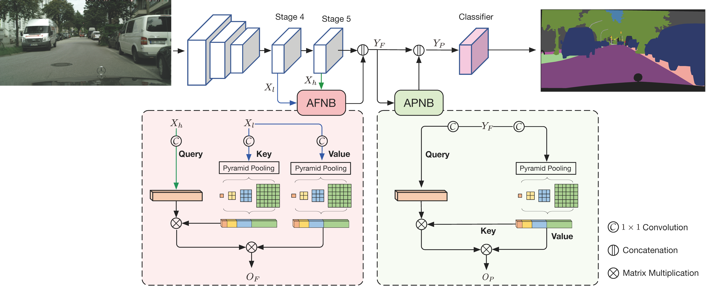

# ANN

This repository is for Asymmetric Non-local Neural Networks for Semantic Segmentation (to appear in ICCV 2019),

by [Zhen Zhu](https://zzhu.vision), [Mengde Xu](https://github.com/MendelXu), [Song Bai](http://songbai.site), [Tengteng Huang](https://github.com/tengteng95) and [Xiang Bai](https://scholar.google.com/citations?hl=en&user=UeltiQ4AAAAJ).

The source code is in preparing. We will release as soon as possible.

### citation
If you find our paper useful in your research, please consider citing:

	@inproceedings{annn,
	  author    = {Zhen Zhu and
	               Mengde Xu and
	               Song Bai and
	               Tengteng Huang and
	               Xiang Bai},
	  title     = {Asymmetric Non-local Neural Networks for Semantic Segmentation},
	  booktitle={International Conference on Computer Vision},
	  year      = {2019},
	  url       = {http://arxiv.org/abs/1908.07678},
	}

### Table of contents
- [Introduction](#introduction)
- [Usage](#usage)
- [Results](#results)
- [Acknowledgement](#acknowledgement)

## Introduction



<div align=center id="model">Fig.1 Model Architecture</div>

In this work, we present Asymmetric Non-local Neural Network to semantic segmentation for acquiring long range dependency efficiently and effectively. The whole network is shown in [Fig. 1](#model). It can fuse features between different level under a sufficient consideration of inter long range dependencies  with AFNB and refine features in the same level involving the inner long range  dependencies with APNB.

## Usage

- Preparation  
  - Prepare running env:
  ```
  python==3.6.8
  gcc==5.4.0
  cuda==9.2
  ```  
  - Install required package
   ```shell
  pip install -r requirements.txt   
  cd ext   
  bash make.sh
   ```
  - Download dataset and pre-process it with scripts in `datasets/seg/preprocess`.   
    Take Cityscapes for example.
    1. Download the leftImg8bit.zip and gtFine.zip from cityscapes-dataset.com and extract those.
    ```
    cd datasets/seg/preprocess/cityscapes
    ```
    2. Modify the variable `ORI_ROOT_DIR` in `cityscapes_seg_generator.sh` to where you save the extracted dataset.
    3. run the preprocessing program.
    ```
    bash cityscapes_seg_generator.sh
    ```
  - Add dataset path where you save the preprocessed dataset to `data.conf` or directly modify the data path in scripts.
  - Download [model](https://drive.google.com/open?id=1bUzCKazlh8ElGVYWlABBAb0b0uIqFgtR) pretrained on imagenet and save it in `./pretrained_models`.
- Train

  Take Cityscapes for example.   
  For training only on train set:
  ```
  # you can change 'tag' to anything you want
  bash scripts/seg/cityscapes/run_fs_annn_cityscapes_seg.sh train tag
  ```
  For training on both train set and validation set:
  ```
  bash scripts/seg/cityscapes/run_fs_annn_cityscapes_seg_test.sh train tag
  ```

- Validation  
  Download trained [model](https://drive.google.com/open?id=1lw4g41l8tX3XZsdW3WuDGDSxiI77Fw13) to `checkpoints/seg/cityscapes/fs_annn_cityscapes_segohem_latest.pth` and test on validation set with single scale.
  ```
  bash scripts/seg/cityscapes/run_fs_annn_cityscapes_seg.sh val ohem
  ```
  The final output should be:
  ```
   classes          IoU      nIoU 
  --------------------------------
  road          : 0.984      nan
  sidewalk      : 0.863      nan
  building      : 0.930      nan
  wall          : 0.521      nan
  fence         : 0.629      nan
  pole          : 0.667      nan
  traffic light : 0.737      nan
  traffic sign  : 0.816      nan
  vegetation    : 0.927      nan
  terrain       : 0.648      nan
  sky           : 0.948      nan
  person        : 0.838    0.000
  rider         : 0.663    0.000
  car           : 0.958    0.000
  truck         : 0.830    0.000
  bus           : 0.894    0.000
  train         : 0.858    0.000
  motorcycle    : 0.669    0.000
  bicycle       : 0.796    0.000
  --------------------------------
  Score Average : 0.799    0.000
  --------------------------------
  
  
  categories       IoU      nIoU
  --------------------------------
  flat          : 0.987      nan
  construction  : 0.936      nan
  object        : 0.735      nan
  nature        : 0.929      nan
  sky           : 0.948      nan
  human         : 0.849    0.000
  vehicle       : 0.945    0.000
  --------------------------------
  Score Average : 0.904    0.000
  --------------------------------
  ```  

- Test on test set

  Download trained [model](https://drive.google.com/open?id=1yNjItS3IREN8Dqn7qB5EK7xpzoPRM8_e) to `checkpoints/seg/cityscapes/fs_annn_cityscapes_segohem_latest.pth` and test on test set with multiple scales.
  ```
  bash scripts/seg/cityscapes/run_fs_annn_cityscapes_seg_test.sh test ohem
  cd results/seg/cityscapes/fs_annn_cityscapes_segohem/test/label
  zip ../res.zip *
  # submit the result on cityscapes official web page.
  ```
  

- Efficiency Statistics

  For details, please refer to `./efficiency_statics/readme.md`.

## Results

Tab.1 Comparisons on the test set of Cityscapes with the state-of-the-art methods.(multi scale testing)   

|  Method   |   Backbone   |   mIOU   |
| ---- | ---- | ----- |
|  DeepLab-V2    |  ResNet-101    |   70.4   |
|  RefineNet    |   ResNet-101   |  73.6    |
|   GCN   |  ResNet-101    |   76.9   |
|DUC|ResNet-101|77.6|
|SAC|ResNet-101|78.1|
|ResNet-38|ResNet-101|78.4|
|PSPNet|ResNet-101|78.4|
|BiSeNet|ResNet-101|78.9|
|AAF|ResNet-101|79.1|
|DFN|ResNet-101|79.3|
|PSANet|ResNet-101|79.3|
|DenseASPP|DenseNet-101|80.1|
|**Ours**|ResNet-101|**81.3**|

Tab.2 Comparisons on the validation set of PASCAL Context with the state-of-the-art methods.(multi scale testing)

|Method |   Backbone   |   mIOU   |
| ---- |---- | ---- |
|FCN-8s|-|37.8|
|Piecewise|-|43.3|
|DeepLab-v2|ResNet-101|45.7|
|RefineNet|ResNet-152|47.3|
|PSPNet|Resnet-101|47.8|
|CCL|ResNet-101|51.6|
|EncNet|ResNet-101|51.7|
|**Ours**|ResNet-101|**52.8**|

Tab.3 Comparisons on the validation set of ADE20k with the state-of-the-art methods.(multi scale testing)  

|Method |   Backbone   |   mIOU   |
| --- |---- | ---- |
|RefineNet|ResNet-152|40.70|
|UperNet|ResNet-101|42.65|
|DSSPN|ResNet-101|43.68|
|PSANet|ResNet-101|43.77|
|SAC|ResNet-101|44.30|
|EncNet|ResNet-101|44.65|
|PSPNet|ResNet-101|43.29|
|PSPNet|ResNet-269|44.94|
|**Ours**|ResNet-101|**45.24**|

## Acknowledgement
  We genuinely thank [Ansheng You](https://github.com/donnyyou) for his kind help and suggestions throughout our work. We also recommend others to implement computer vision algorithm with his framework [torchcv](<https://github.com/donnyyou/torchcv>).

  

  
